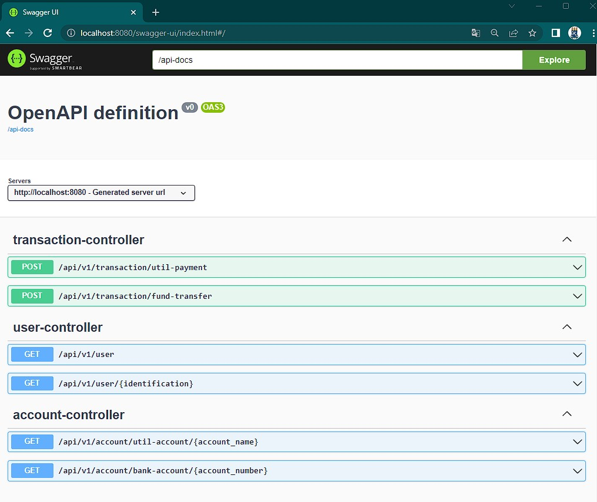
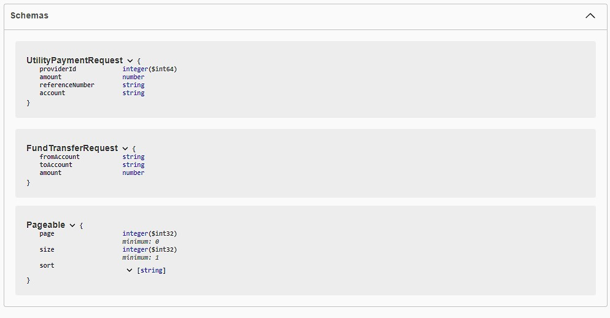
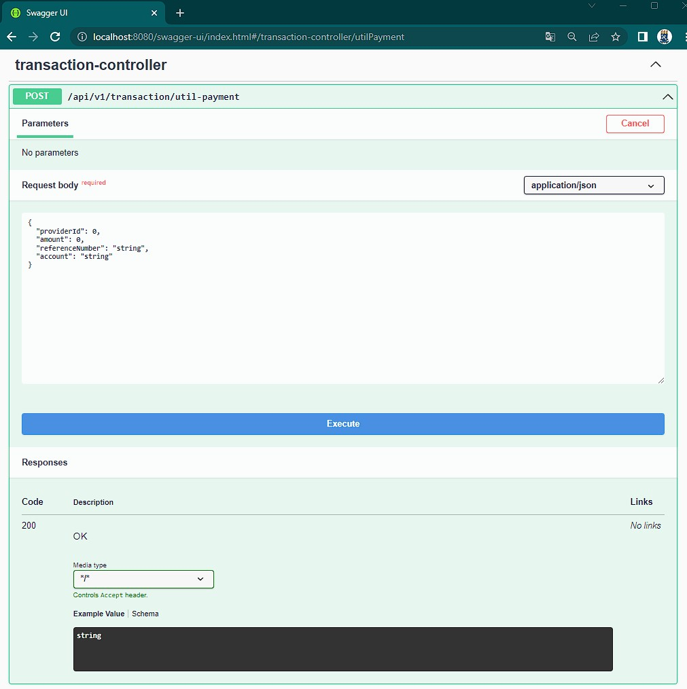

# spring-boot-api-tuto

Scaffolding Api REST em JAVA com MySQL e Swagger

## Padrões de arquitetura

* model
* controller
* repository
* service
* data transfer object

## Tecnologias utilizadas

* JAVA 17
* Maven 3.8.7
* Spring Boot 2.7 (Gerar projeto inicial)
* Lombok (Decorators getters, setters)
* Swagger 1.6 (Documentar API)

## Configurar Banco de Dados

Alterar a string de conexão no arquivo `application.properties` e criar uma base dados banking `MySQL`

    spring.datasource.url=jdbc:mysql://localhost:3306/banking
    spring.datasource.username=root
    spring.datasource.password=password

Em seguida executar os scripts que estão dentro da pasta [migration](https://github.com/sganzerla/spring-boot-api-tuto/tree/main/demo/src/main/resources/db/migration) na ordem abaixo, para criar as tabelas e popular com alguns dados:

    - V1.0.20210427174638__create_base_table_structure.sql
    - V1.0.20210427174721__temp_data.sql
    - V1.0.20210429210839__create_transaction_table.sql

## Como Rodar Aplicação

Certifique-se antes de mais nada de ter o Java e o Maven instalados.

Para gerar o artefato jar execute o comando abaixo dentro da pasta raiz `demo`:

    mvn package

Para rodar a aplicação

    java -jar .\target\PayRoll-0.0.1-SNAPSHOT.jar

## Testar a API

Acessar o endereço:

    http://localhost:8080/swagger

O Swagger ao mesmo tempo que documenta possibilita testar as chamadas e os retornos da controller.

Página inicial exibindo todas as controllers:

Também exibe a estrutura de dados de todos os objetos expostos nas controllers tanto como entrada de dados quanto como saída, sendo uma ótima opção para quem fará integração com ela.

Clicando em cada controller abrirá a opção para testar as chamadas com o objeto pré preenchido.

Para alterar o endereço de exibição da página do swager alterar em `application.properties`.

    springdoc.api-docs.path=/api-docs
    springdoc.swagger-ui.path=/swagger

## Fonte

Baseado no tutorial de [Chinthaka Dinadasa, 2021](https://javatodev.com/microservices-core-banking-service-implementation/). Acessado Jan 2023.
